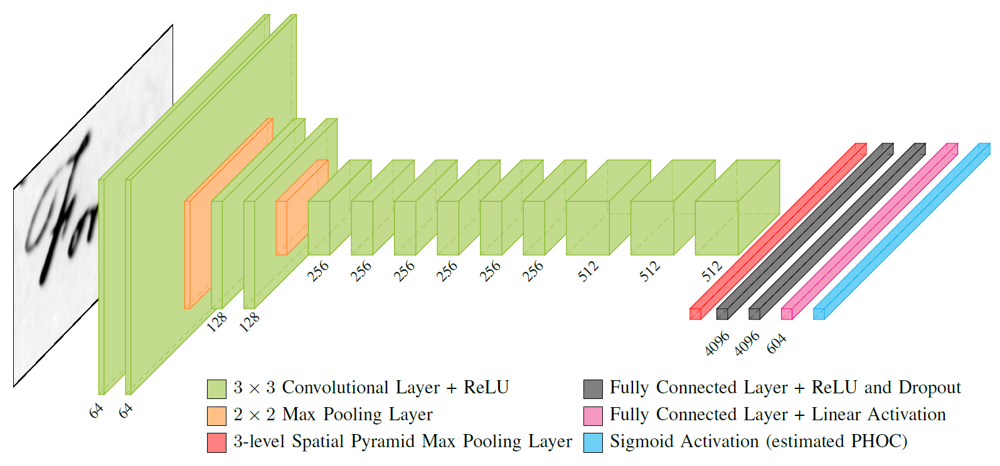

# PHOCNet


PHOCNet is a Convolutional Neural Network for classifying document image attributes. This Python library was the base for generating the results in [PHOCNet: A Deep Convolutional Neural Network for Word Spotting in Handwritten Documents](http://patrec.cs.tu-dortmund.de/pubs/abstracts/Sudholt2016-PAD.htm) and [Evaluating Word String Embeddings and Loss Functions for CNN-based Word Spotting](http://patrec.cs.tu-dortmund.de/pubs/abstracts/Sudholt2017-EWS.htm).

If you use the code for scientific purposes, please cite
```
@inproceedings{Sudholt2017-EWS,
   booktitle = {Proc. Int. Conf. on Document Analysis and Recognition},
   author = {Sudholt, Sebastian and Fink, Gernot A.},
   title = {{Evaluating Word String Embeddings and Loss Functions for CNN-based Word Spotting}},
   year = {2017}
}
```
or
```
@inproceedings{Sudholt2016-PAD,
   arxivId = {arXiv:1604.00187v2},
   booktitle = {Proc. Int. Conf. on Frontiers in Handwriting Recognition},
   author = {Sudholt, Sebastian and Fink, Gernot A.},
   title = {{PHOCNet : A Deep Convolutional Neural Network for Word Spotting in Handwritten Documents}},
   year = {2016}
}
```

If you're interested in a PyTorch implementation, George Retsinas has made his port available [here](https://github.com/georgeretsi/pytorch-phocnet).

## Prerequisites
THe PHOCNet library has the following dependencies:
- Customized Caffe (supplied as submodule)
- numpy
- skimage
- scipy
- LMDB/Python LMDB Bindings
- OpenCV/Python OpenCV Bindings

## Installation
Please refer to the installation instructions on how to install the PHOCNet library and its dependencies.

## Trained PHOCNets
Trained PHOCNets for the four George Washington cross validation splits are available [here](http://patrec.cs.tu-dortmund.de/cms/en/home/Resources/index.html). They were trained using the files under the `experiment/gw` folder. Each PHOCNet file has a size of approx. 278 MB. Note that the unigrams in the predicted PHOC are sorted by ASCII value, resulting in the order `0123456789abcdefghijklmnopqrstuvwxyz`. Thus the first 36 attributes in the predicted PHOC indicate the existance of the unigrams in the left part of the word image, starting at `0` and ending at `z`.

## Usage
You can either embed this code in your project and call the classes from there or use any auf the auxilliary scripts under the `tools` directory.
For a quick evaluation, we provide READ-style XML files for the George Washington database with the cross validation splits used in our paper.
If you want to have a look into how to predict PHOCs from the API, checkout the `examples` folder.

### Predict PHOCs for Images on Disk
If you have a number of segmented word images on disk and quickly want to predict PHOCs from a pretrained PHOCNet, you can simply use the `predict_phocs.py` script.
The minimally required parameters for the script are the location of the folder of word images, the location of the pretrained PHOCNet
and the location of the prototxt file with the design specification of the PHOCNet. The prototxt file can simply be generated by calling the `save_deploy_proto.py` script in the tools folder.
After this you can predict the PHOCs by calling
```
python predict_phocs.py --img_dir <your word image fodler> --pretrained_phocnet <path to pretrained PHOCNet> --deploy_proto <path to previously generated prototxt file>
```

More information and further parameters for this script can be found by calling
```
python predict_phocs.py -h
```

### Training and Testing with READ-style XMLs
The PHOCNet library is able to process READ-style XML files for the training and testing PHOCNets. The layout of such an XML file is shown below.
```
<?xml version="1.0" encoding="utf-8" ?>
<wordLocations dataset="my_dataset">
    <spot word="convolutional" image="doc_image1" x="123" y="55" w="123" h="50" />
    <spot word="neural" image="doc_image1" x="553" y="97" w="100" h="59" />
    <spot word="networks" image="doc_image2" x="94" y="1197" w="244" h="62" />
    <!-- The rest of the words in the dataset -->
</wordLocations>
```
The `image` value is always interpreted relative to the path specified with the `--doc_img_dir` parameter. 
A number of sample XML files can be found under `experiments`. You can either use the sample XML files or create your own training and test XML files.

If you want to train your own PHOCNet from scratch you need to define a training and testing XML file. If you have your XMLs defined, you need to call the `train_phocnet.py` script under the tools folder. The minimally necessary parameters are
```
python phocnet_experiment.py --doc_img_dir <folder of the doc. images> --train_annotation_file <READ-style train XML> --test_annotation_file <READ-style test XML> --proto_dir <folder for protofiles> --lmdb_dir <folder for lmdbs>
```
For fast training, the PHOCNet library makes use of LMDB database as input for Caffe. During the first run of an experiment, the LMDBs are created automatically. For this you need to specify where to save the LMDB files. Keep in mind that LMDBs can easily grow to a couple of hundreds of GB. 
After the first run, the created LMDBs are used in consecutive experiments for the same dataset.

Once you have a trained PHOCNet or obtained one of our pretrained nets, you can evaluate it on the test data. For a Query-by-Example evaluation, simply call the `eval_phocnet.py` script in the tools folder with the following parameters
```
python eval_phocnet.py qbe --word_xml_file <READ-style test XML> --doc_img_dir <folder of the doc. images> --phocnet_bin_path <path to the previously trained PHOCNet>
```
The output of the script should be similar to this
```
[2016-08-29 08:56:10,261, PHOCNetEvaluation] --- Query-by-Example Evaluation ---
[2016-08-29 08:56:10,261, PHOCNetEvaluation] Loading XML file from: gw/gw_cv1_test.xml...
[2016-08-29 08:56:10,303, PHOCNetEvaluation] Found dataset: gw_cv1
[2016-08-29 08:56:10,303, PHOCNetEvaluation] Saving PHOCNet deploy proto file to ./deploy_phocnet.prototxt...
[2016-08-29 08:56:10,312, PHOCNetEvaluation] Creating PHOCNet...
[2016-08-29 08:56:12,149, PHOCNetEvaluation] Predicting PHOCs for 1215 test words
[2016-08-29 08:57:59,305, PHOCNetEvaluation]     [  100 / 1215 ]
[2016-08-29 08:59:39,135, PHOCNetEvaluation]     [  200 / 1215 ]
[2016-08-29 09:01:26,355, PHOCNetEvaluation]     [  300 / 1215 ]
[2016-08-29 09:03:09,731, PHOCNetEvaluation]     [  400 / 1215 ]
[2016-08-29 09:04:50,607, PHOCNetEvaluation]     [  500 / 1215 ]
[2016-08-29 09:06:33,984, PHOCNetEvaluation]     [  600 / 1215 ]
[2016-08-29 09:08:27,224, PHOCNetEvaluation]     [  700 / 1215 ]
[2016-08-29 09:10:04,031, PHOCNetEvaluation]     [  800 / 1215 ]
[2016-08-29 09:11:32,662, PHOCNetEvaluation]     [  900 / 1215 ]
[2016-08-29 09:13:05,958, PHOCNetEvaluation]     [ 1000 / 1215 ]
[2016-08-29 09:14:44,837, PHOCNetEvaluation]     [ 1100 / 1215 ]
[2016-08-29 09:16:22,566, PHOCNetEvaluation]     [ 1200 / 1215 ]
[2016-08-29 09:16:35,238, PHOCNetEvaluation]     [ 1215 / 1215 ]
[2016-08-29 09:16:35,241, PHOCNetEvaluation] Calculating mAP...
[2016-08-29 09:16:35,913, PHOCNetEvaluation] mAP: 96.938955
```
As before, you can find out more usage information and additonal parameters through
```
python eval_phocnet.py -h
```

### GPU/CPU
The PHOCNet library can be run on GPUs as well as CPUs. For most scripts, GPU mode is activated if the parameter `--gpu_id` is passed to the experiment script with a valid GPU ID. If no GPU ID is specified, the experiment is run in CPU mode. If you embed part of the library into your own project, you need to activate the GPU mode yourself.
```
caffe.set_mode_gpu()
caffe.set_device(0) # or whatever GPU you want to use
```

### TPP-PHOCNet
The TPP layer introduced in [Evaluating Word String Embeddings and Loss Functions for CNN-based Word Spotting](http://patrec.cs.tu-dortmund.de/pubs/abstracts/Sudholt2017-EWS.htm) has been added to the repository. When updating, make sure to update the supplied `caffe` submodule as well and rebuilding it to enable the use of the TPP layer.
The TPP-PHOCNet architecture has been added to the proto generator file at `src/phocnet/caffe/model_proto_generator.py` and can be used whereever the PHOCNet was previously used.
